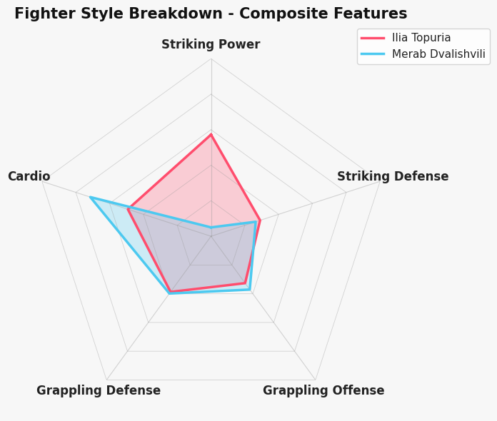

## Skills & Tools

Core strengths I bring to analytics and ML work. This section highlights my practical toolkit for building data-driven models, visualizations, and production-ready workflows.

  <h3 style="margin:0 0 12px; font-size:16px; color:#333;">Languages</h3>
  

    Python
    SQL
    R
    MATLAB
    Java
  

  <h3 style="margin:20px 0 12px; font-size:16px; color:#333;">Data Wrangling</h3>
  

    pandas
    NumPy
    Polars
    dplyr
    data.table
    Spark SQL
  

  <h3 style="margin:20px 0 12px; font-size:16px; color:#333;">ML / Modeling</h3>
  

    PyTorch
    Scikit-learn
    XGBoost
    PySpark
    StatsModels
    Databricks
    OpenAI API
  

  <h3 style="margin:20px 0 12px; font-size:16px; color:#333;">Analytics</h3>
  

    A/B Testing
    Causal Inference
    Time Series
    Segmentation
    Forecasting
    Bayesian Statistics
    Experimental Design
  

  <h3 style="margin:20px 0 12px; font-size:16px; color:#333;">Visualization</h3>
  

    Tableau
    Power BI
    matplotlib
    seaborn
    ggplot
    Plotly
  

  <strong>Certification:</strong> MLOps Essentials: Model Development and Integration · LinkedIn Learning

 
---
## Projects
---
### Regression

#### [Predicting Housing Sale Price Intervals](https://nbviewer.org/github/sgracia19/sgracia19.github.io/blob/main/projects/Kaggle_Competitions/House_Price_Intervals/Price_Interval_Prediction.ipynb)

  Python
  PyTorch
  Scikit-learn
  XGBoost
  pandas
  NumPy
  Interval regression

In this project, I tackled a Kaggle competition focused on predicting house sale prices with the narrowest possible prediction intervals, rather than just point estimates. I engineered features from raw sale and property data, handled missing values, and encoded categorical variables to prepare the dataset for modeling. My core approach used a pytorch to build a neural network that outputs lower and upper bounds for each prediction, trained with the Winkler loss to directly optimize interval quality and coverage. The model achieved 93.9% empirical coverage, exceeding the nominal 90% target. To further improve performance, I experimented with architectural changes, regularization, and feature engineering. 

---

### Clustering

#### [The Ultimate Statistical Fighter v2: UFC Fighter Segmentation Revisited](https://github.com/sgracia19/UFC_Fighter_Segmentation)

  Python
  pandas
  feature engineering
  clustering
  visualization
  reusable code

This project is a revisit of an earlier analysis, rebuilt from the ground up with a richer dataset and a stronger emphasis on software engineering best practices. Using a comprehensive dataset of historical UFC fight results, I engineered a robust set of per-fighter features such as including striking accuracy, takedown rates, submission threats, and fight pace metrics. Unlike the original project, this iteration prioritizes modular, reusable Python code with clean separation between data ingestion, processing, and analysis, making the pipeline easier to maintain and extend.
The goal is to uncover meaningful fighter archetypes through unsupervised machine learning: from aggressive knockout artists to technical grapplers and decision-focused point fighters. 
Future work aims to bring these findings to life through an interactive web application, where users can explore fighter clusters visually, compare stylistic profiles side-by-side, and discover which fighters share the most similar fighting styles — making the analysis accessible and engaging beyond the notebook.

#### [The Ultimate Statistical Fighter: UFC Fighter Segmentation](https://nbviewer.org/urls/sgracia19.github.io/projects/ufc-fighter-style-segmentation.ipynb)

  Python
  clustering
  Silhouette analysis
  feature engineering
  matchup analysis

Developed a data-driven clustering model to analyze fighter characteristics, fight outcomes, and fight metrics to identify
distinct fighting styles. Conducted feature engineering, correlation analysis, and visualization to refine insights. Evaluated
segmentation quality using Silhouette scores and within-cluster variance. Conducted matchup analysis to quantify stylistic
advantages, revealing trends in performance across fight styles and weight classes. Future work aims to expand dataset for
more robust classifications and to leverage cluster labels in predictive modeling.

---

### Reinforcement Learning
#### [Master's Research Project: Policy Gradient Methods in Deep Reinforcement Learning](projects/Sebastian_Gracia_MS_project.pdf)

  Python
  policy gradients
  reinforcement learning
  simulation
  research

My master's research project gives an overview of the mathematical theory behind certain policy based methods in reinforcement learning. The project covers the basics of Reinforcement Learning, including MDPs, the agent-environment framework, and value functions. My research project goes on to cover the Policy Gradient Theorem and how it allows is Policy Gradient algorithms for reinforcement learning. My project then discuss a few selected algorithms and implementations on selected environments. For a condensed, slightly less technical outline of my project, see my [project defense slides](projects/MS_Defense_Slides.pdf).

    <video style="width: 48%; max-width: 100%; height: auto;" controls autoplay>
        <source src="/images/HalfCheetah_Trained.mp4" type="video/mp4">
        Your browser does not support the video tag.
    </video>
    <video style="width: 48%; max-width: 100%; height: auto;" controls autoplay>
        <source src="/images/Pong_Trained_Agent.mp4" type="video/mp4">
        Your browser does not support the video tag.
    </video>

#### [Rainbow Road: Autonomous Driving using DQN Variants](projects/RainbowRoad.pdf). [Code Here](https://nbviewer.org/urls/sgracia19.github.io/projects/RainbowRoad.ipynb)

  Python
  Rainbow DQN
  reinforcement learning
  agent evaluation
  simulation

The reinforcement learning algorithm DQN introduced by Minh et. al has many different variants which
improve performance. This project implements the ideas presented by Matteo Hessel et al. showing that combinging many of the variants yields superior performance across different benchmarks than any single variant. The aim of this project was
to implement Rainbow DQN in a simple autonomous driving environment
and compare results obtained to results obtained to the paper.

---
### Optimization
#### [Online Optimization using Greedy Projection Algorithm](projects/Online_Optimization.pdf)

  MATLAB
  online optimization
  convex programming
  algorithm design
  numerical experiments

Online convex programming is a form of convex programming in which a convex
set is known ahead of time. At each iteration a point is selected from the convex
set then a repeated minimization problem is solved at the point. At each step
a corresponding cost function is evaluated. The cost function however is not
known ahead of time. This project explores an algorithm to minimize possible
costs incurred in an online convex problem. It is called the Greedy Projection
Algorithm. In this project, we introduce the background and properties of this
algorithm, then apply it by hand and numerically via MATLAB code to a set
of Online optimization problems, then discuss the results of each.

#### [Sudoku Solver Using Linear Programming](projects/Sudoku.pdf)

  MATLAB
  linear programming
  optimization
  ℓ1 relaxation
  model formulation

Sudoku problems can be modeled as a sparse linear system of equations. We can formulate the Sudoku ruleset as an underdetermined linear system and the objective as an $\ell_0$ norm minimization problem. Since it is hard to solve an $\ell_0$ norm minimization problem in general, we
relax the objective function to a $\ell_1$ norm minimization problem.

Page template forked from <a href="https://github.com/evanca/quick-portfolio">evanca</a>

<!-- Remove above link if you don't want to attibute -->
